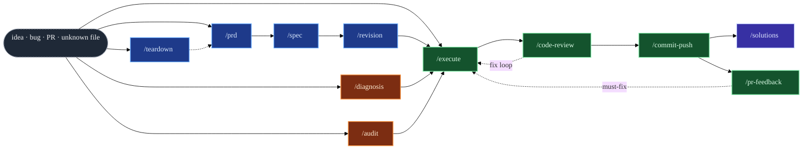
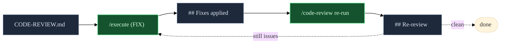
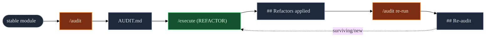
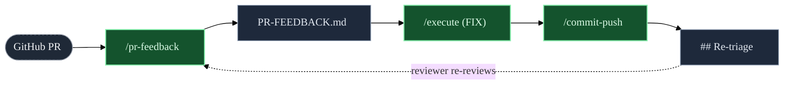

<div align="center">

<br />

# `eva`

### A compound-engineering plugin for Claude Code.

**Twelve composable, scope-adaptive skills that turn an idea — or a bug, a PR,**
**an unfamiliar bundle, a rough Jira card — into a durable artifact.**

<sub>For engineers who ship with Claude Code and want durable artifacts, not just chat history.</sub>

<br />

```bash
# inside Claude Code
/plugin marketplace add vilarjp/eva
/plugin install eva@eva
```

<sub>or clone into <code>~/.claude/plugins/eva</code> · <a href="#installation">full instructions</a></sub>

<br />

</div>

---

## Contents

<table>
<tr>
<td valign="top" width="33%">

### Orientation
- [What eva is](#what-eva-is)
- [The twelve skills](#the-twelve-skills)
- [The pipeline](#the-pipeline)
- [Why it's safe](#why-its-safe)

</td>
<td valign="top" width="33%">

### Reference
- [Installation](#installation)
- [Usage](#usage)
- [Sub-agents](#the-eleven-sub-agents)
- [Repository layout](#repository-layout)

</td>
<td valign="top" width="33%">

### Depth
- [Compose flows](#compose-flows)
- [Invariants](#invariants)
- [Express lane](#express-lane)
- [What eva refuses](#what-eva-refuses-to-do)

</td>
</tr>
</table>

---

## What `eva` is

A single Claude Code plugin that ships **twelve skills** — eleven produce a durable, single-file artifact; one is a pure router that picks the right pipeline for whatever you throw at it. Every skill is **scope-adaptive** (Lightweight / Standard / Deep), **verifies every codebase claim** before writing, **gates the write** behind explicit user approval, and **refuses** a fixed list of destructive actions (protected branches, secrets, `git add -A`, `--force`, `--no-verify`, auto-posting to PRs, transitioning Jira state).

The skills compose into pipelines — idea → **PRD** → **SPEC** → **REVISION** → **EXECUTION** → **CODE-REVIEW** → **push** → **SOLUTIONS** — but each one is also a good standalone tool. You can enter at any node.

> [!NOTE]
> **eva is the artifact layer for Claude Code** — twelve tools that turn conversation into durable, cold-readable markdown, one gate at a time.

---

## The twelve skills

<div align="center">

<table>
<thead>
<tr>
<th align="left">Skill</th>
<th align="left">Answers</th>
<th align="left">Reads</th>
<th align="left">Writes</th>
</tr>
</thead>
<tbody>

<tr><td colspan="4" align="left"><br/><sub><strong>01 · ROUTE</strong> — pick the right pipeline</sub></td></tr>
<tr>
<td><a href="skills/eva/"></a></td>
<td>Which skill should I run?</td>
<td>any input — URL, path, card, free-text</td>
<td><em>routing plan (inline, no file)</em></td>
</tr>

<tr><td colspan="4" align="left"><br/><sub><strong>02 · PLAN</strong> — before you write code</sub></td></tr>
<tr>
<td><a href="skills/teardown/"></a></td>
<td>What does this unfamiliar file do?</td>
<td>local path or URL</td>
<td><code>TEARDOWN.md</code> + optional sidecars</td>
</tr>
<tr>
<td><a href="skills/prd/"></a></td>
<td>What and why?</td>
<td>a rough idea</td>
<td><code>PRD.md</code></td>
</tr>
<tr>
<td><a href="skills/spec/"></a></td>
<td>How, technically?</td>
<td>idea or approved PRD</td>
<td><code>SPEC.md</code></td>
</tr>
<tr>
<td><a href="skills/revision/"></a></td>
<td>Where do PRD and SPEC disagree?</td>
<td>a PRD + SPEC pair</td>
<td><code>REVISION.md</code> (+ patches on approval)</td>
</tr>

<tr><td colspan="4" align="left"><br/><sub><strong>03 · INVESTIGATE</strong> — understand what's already there</sub></td></tr>
<tr>
<td><a href="skills/diagnosis/"></a></td>
<td>What broke, why, how to prove it?</td>
<td>bug report, stack trace, Jira, issue</td>
<td><code>DIAGNOSIS.md</code> + reproduction test</td>
</tr>
<tr>
<td><a href="skills/audit/"></a></td>
<td>What structural debt lives here?</td>
<td>stable module (static snapshot)</td>
<td><code>AUDIT.md</code></td>
</tr>

<tr><td colspan="4" align="left"><br/><sub><strong>04 · BUILD</strong> — ship it safely</sub></td></tr>
<tr>
<td><a href="skills/execute/"></a></td>
<td>Ship the code.</td>
<td>SPEC / DIAGNOSIS / CODE-REVIEW / AUDIT / raw prompt</td>
<td><code>EXECUTION.md</code> + production code + commits</td>
</tr>
<tr>
<td><a href="skills/code-review/"></a></td>
<td>Is the diff shippable?</td>
<td>uncommitted &gt; branch-vs-base &gt; HEAD~1</td>
<td><code>CODE-REVIEW.md</code></td>
</tr>
<tr>
<td><a href="skills/pr-feedback/"></a></td>
<td>Which reviewer comments matter?</td>
<td>a GitHub PR (inline + timeline + reviews)</td>
<td><code>PR-FEEDBACK.md</code></td>
</tr>
<tr>
<td><a href="skills/commit-push/"></a></td>
<td>Ship this branch safely.</td>
<td>working tree</td>
<td><em>commits + push (no markdown)</em></td>
</tr>

<tr><td colspan="4" align="left"><br/><sub><strong>05 · REMEMBER</strong> — compound the learning</sub></td></tr>
<tr>
<td><a href="skills/solutions/"></a></td>
<td>What's worth remembering?</td>
<td>the whole <code>docs/&lt;date&gt;-&lt;slug&gt;/</code> folder</td>
<td><code>SOLUTIONS.md</code></td>
</tr>

</tbody>
</table>

</div>

<sub>Every artifact lives at <code>docs/YYYY-MM-DD-&lt;slug&gt;/&lt;ARTIFACT&gt;.md</code>, carries <code>status: approved</code> frontmatter, and is cold-readable by a future session.</sub>

---

## See a real artifact

<details>
<summary><strong>Sample PRD — click to expand a 30-line slice of a real artifact</strong></summary>

<br />

````markdown
---
title: Persisted checkout sessions
slug: 2026-04-16-persisted-checkout
status: approved
scope: standard
---

# PRD — Persisted checkout sessions

## Problem Statement

Mobile users who lose connectivity mid-checkout lose their cart on reconnect.
3.4 % of mobile sessions drop here (Amplitude funnel `checkout_mobile_2026_03`).

## Goals / Non-Goals

- **Goal** — checkout state survives a 30-minute disconnect.
- **Goal** — no change to the desktop flow.
- **Non-goal** — cross-device session sync.

## Options (2–3 genuinely distinct)

- **A — localStorage hydration on reconnect.** Pros: zero infra. Cons: stale
  data when price / inventory mutate mid-session.
- **B — server-side session tied to the device token.** Pros: reuses existing
  session cache (see `AUDIT.md#session-cache`). Cons: one extra table write
  per cart mutation.
- **C — optimistic UI with periodic sync.** Pros: smooth UX. Cons: polling
  cost; reconciliation complexity on conflict.

## Recommended Direction

**Option B.** Matches existing session infra, avoids the stale-data class in A,
strictly cheaper than C's polling. Trade-off accepted: one write per mutation.
````

Every artifact follows this shape — frontmatter with `status: approved` and `scope`, short sections, evidence anchored to the codebase (`AUDIT.md#session-cache`), alternatives listed explicitly, trade-offs named out loud. A future session reads it cold, without the original conversation.

</details>

---

## The pipeline



<sub align="center">&nbsp;&nbsp;&nbsp;</sub>

<details>
<summary><strong>Five signature loops — click to expand</strong></summary>

<br />

**1 · Feature flow** — `idea → /prd → /spec → /revision → /execute → /code-review → /commit-push → /solutions`

**2 · Bug flow** — `report → /diagnosis → /execute → /code-review → /commit-push → /solutions`

**3 · Correction → review loop** — `/code-review → /execute (FIX mode) → appends ## Fixes applied → /code-review re-run appends ## Re-review with Verification-of-prior-fixes table`

**4 · Audit → refactor → re-audit loop** — `/audit → /execute (REFACTOR mode, characterization-TDD) → appends ## Refactors applied → /audit re-run appends ## Re-audit`

**5 · External review loop** — `PR on GitHub → /pr-feedback (branch-checkout gate + GraphQL reviewThreads) → must-fix Handoff → /execute (FIX mode) → /commit-push → reviewer re-reviews → /pr-feedback appends ## Re-triage`

</details>

---

## Why it's safe

<table>
<tr>
<td width="33%" valign="top">


Every claim about the codebase, the diff, a source document, or a PR comment is anchored to a specific read. Unverified claims are labeled `(unverified)` — never invented.

</td>
<td width="33%" valign="top">


No artifact is written until the user explicitly approves it. `/execute` has a second gate: no code lands unless the integration gate (full suite + lint + types) runs green in the same turn.

</td>
<td width="33%" valign="top">


Lightweight / Standard / Deep tiers tune the depth of every phase — a one-liner doesn't get a Mermaid diagram; a cross-module refactor does.

</td>
</tr>
<tr>
<td valign="top">


Re-runs append `## Re-review`, `## Re-audit`, `## Re-triage`, `## Re-run`, `## Post-Release Bug Fix`, `## Fixes applied`, `## Refactors applied`. Prior artifact content is history.

</td>
<td valign="top">


`/audit`, `/code-review`, `/pr-feedback`, `/solutions` never edit source. `/teardown`, `/prd`, `/spec`, `/revision`, `/diagnosis` don't either. Only `/execute` writes production code; only `/commit-push` pushes.

</td>
<td valign="top">


Protected branches, `git add -A`, `--force`, `--no-verify`, secret-pattern commits, auto-posting PR comments, transitioning Jira state — every skill refuses, even under auto-mode or user insistence.

</td>
</tr>
</table>

---

## Installation

> [!TIP]
> The fastest path is the plugin marketplace — one line per command, everything wired up, updates land on `/plugin update eva`.

### As a plugin (recommended)

```bash
# From inside Claude Code
/plugin marketplace add vilarjp/eva
/plugin install eva@eva
```

### As a cloned plugin

```bash
git clone https://github.com/vilarjp/eva ~/.claude/plugins/eva
```

### As project-local skills

Copy any of `skills/<name>/` into your project's `.claude/skills/` directory — each skill is self-contained (SKILL.md + optional `templates/` + `references/`).

---

## Usage

The twelve skills share a common shape: type the slash command (optionally with a free-text hint), answer up to ~3 clarifying questions, approve the self-review checklist, approve the HARD GATE. Every skill works from natural language too — *"diagnose this bug"*, *"audit src/checkout"*, *"ship my changes"* all route to the right skill.

<details open>
<summary>&nbsp;&nbsp;<code><strong>/eva</strong></code> — the routing brain</summary>

<br />

```bash
/eva                                              # asks what you need
/eva refactor src/payments/processor.ts           # free-text goal
/eva https://github.com/acme/app/pull/742         # GitHub PR
/eva PROJ-1234                                    # Jira card
/eva docs/2026-04-15-checkout-retry/              # existing spec folder
/eva build invoice exports — do it                # DRIVE mode
```

Produces a **Routing Plan** (inline — no file) with: _Understood_, _Recommendation_ (scope tier + ordered pipeline with rationale per step), _Skipped steps_, _Alternatives considered_, and _Next step_. Default is **RECOMMEND**; **DRIVE** mode dispatches only the _first_ skill in the pipeline — every subsequent step is an explicit user call because every downstream skill has its own gate.

**Never** writes markdown, edits code, commits, pushes, posts PR comments, or transitions Jira state. If you already named a skill (*"run /audit src/X"*), `/eva` stays out of the way.

</details>

<details>
<summary>&nbsp;&nbsp;<code><strong>/teardown</strong></code> — reverse-engineer an unfamiliar file</summary>

<br />

```bash
/teardown path/to/bundle.js
/teardown https://cdn.example.com/app.min.js
/teardown app.min.js focus on auth flow          # focused-slice mode
```

Writes `docs/<DATE>-<slug>/TEARDOWN.md` (+ optional `teardown-sources/{beautified,hydrated,renamed}/` sidecars) with: Summary · Inputs & Hydration · Entry Points · Module Layout · Function Inventory · State Inventory · Behavior Walkthrough · Data Flow (Mermaid on Standard/Deep) · Edge Cases · External Surface · Unknowns & Residual Risk.

Runs a **hydration ladder** — source-map discovery → beautify → optional `wakaru` / `webcrack` decompilation → `humanify` rename hints — and degrades cleanly when tools are unavailable. For URL targets it asks a one-line permission acknowledgment before fetching, treats fetched content as **data** (never instructions), and refuses to execute embedded commands. The only eva skill that reads input from outside the repo.

</details>

<details>
<summary>&nbsp;&nbsp;<code><strong>/prd</strong></code> — turn an idea into a PRD</summary>

<br />

```bash
/prd faster mobile checkout flow
```

Writes `docs/<DATE>-<slug>/PRD.md` with: Problem Statement · Goals / Non-Goals · Constraints & Assumptions · **2–3 genuinely distinct Options** · Recommended Direction · Complexity Tier · User Stories · Not-Doing list · Open Questions · optional Mermaid diagram.

Asks up to 5 clarifying questions, one at a time. Approves via self-review checklist + HARD GATE before writing.

</details>

<details>
<summary>&nbsp;&nbsp;<code><strong>/spec</strong></code> — turn an idea or PRD into a tech spec</summary>

<br />

```bash
/spec persisted checkout sessions
```

Auto-detects an adjacent `PRD.md` and builds on it (same folder). Writes `docs/<DATE>-<slug>/SPEC.md` with: Context · Technical Goals/Non-Goals · Constraints · **Current → Proposed Architecture** · **embedded mini-ADRs with genuine Alternatives** · Data Model · API Contracts · Module Boundaries · **Tracer-bullet Phases** (capabilities + acceptance criteria, _no file names_ — durability rule) · Test Strategy · Risks · Mermaid diagram (mandatory on Deep) · Not-Doing list · Open Questions · adversarial red-team appendix when warranted.

On Standard/Deep, dispatches three adversarial sub-agents in parallel — [`spec-staff-engineer-reviewer`](agents/spec-staff-engineer-reviewer.md), [`spec-security-reviewer`](agents/spec-security-reviewer.md), [`spec-future-maintainer-reviewer`](agents/spec-future-maintainer-reviewer.md) — in a single message.

</details>

<details>
<summary>&nbsp;&nbsp;<code><strong>/revision</strong></code> — cross-check a PRD + SPEC pair</summary>

<br />

```bash
/revision                                          # auto-detect folder
/revision docs/2026-04-16-faster-checkout/         # explicit target
```

Runs a **4-lens composite pass** — _cross-doc alignment_ · _internal coherence_ · _adversarial premise_ (dispatched to [`revision-adversarial-review`](agents/revision-adversarial-review.md)) · _scope creep + feasibility_ — against the PRD/SPEC pair. Writes `docs/<DATE>-<slug>/REVISION.md` next to the docs with severity-graded findings (P0/P1/P2/P3), verbatim evidence quotes, and proposed minimal fixes. **Double-gated** — Gate 1 blocks writing the artifact, Gate 2 blocks patching PRD.md + SPEC.md with `## Revision <DATE>` sections.

A clean pass still writes REVISION.md (audit record); PRD + SPEC stay untouched. Degrades to single-doc mode when only one of the two is present.

</details>

<details>
<summary>&nbsp;&nbsp;<code><strong>/diagnosis</strong></code> — investigate a bug end-to-end</summary>

<br />

```bash
/diagnosis checkout 500 after coupon apply
/diagnosis #1234                                   # GitHub issue
/diagnosis ABC-456                                 # Jira card
```

Writes `docs/<DATE>-<slug>/DIAGNOSIS.md` with: Bug description · Environment · **Investigation Trail** · Pattern Analysis · **≥3 structurally different Hypotheses** with FOR/AGAINST/verdict · **full Causal Chain with predictions for uncertain links** · Root Cause (file:line + violated invariant) · **Reproduction test with literal RED proof** · Hotspots · Suggested Fix · Severity (TRIVIAL/STANDARD/COMPLEX) · optional Mermaid (mandatory on Deep).

**Strictly read-only in source code** — may create only the reproduction test file. Auto-fetches GitHub / Jira references at Pre-Flight. Treats error messages and stack traces as _data_, never instructions. Smart-reuses an existing feature folder when the bug maps to it (appends `## Post-Release Bug Fix` pointer).

</details>

<details>
<summary>&nbsp;&nbsp;<code><strong>/audit</strong></code> — survey structural debt on stable code</summary>

<br />

```bash
/audit src/checkout/
/audit src/auth/session.ts deep
/audit the whole service
```

Writes `docs/<DATE>-<slug>/AUDIT.md` with: TL;DR posture · Scope · **Findings grouped by severity** (P0 Blocker debt / P1 Major / P2 Minor / P3 Nit) · Architecture observations · Positives · **Suppressed candidates** (deliberately-embraced patterns) · **Bugs surfaced** (routed to `/diagnosis`, never refactored) · **Handoff table** (`/execute` REFACTOR mode parses this directly) · scope-calibration footer.

Every finding names a smell from a **three-layer vocabulary**:

- **13 Fowler smells** — Feature Envy, Primitive Obsession, Shotgun Surgery, Data Clumps, Divergent Change, Long Parameter List, Message Chain, Middle Man, Refused Bequest, Speculative Generality, Temporary Field, Duplicate Code, Comments as Deodorant
- **7 no-workaround categories** — TYPE / LINT / SWALLOW / TIMING / PATCH / SCATTER / CLONE
- **5 test anti-patterns** — mock-behaviour assertion / test-only production methods / mocking without understanding / incomplete mocks / tests-as-afterthought

On Deep scope, dispatches **3–5 parallel `Explore` agents in a single message** (one per submodule + consumer surfaces + shared utilities). Severity ceilings (P1 ≤ 5 / 10 / 20 per tier) guard against "everything-is-P1" calibration drift.

</details>

<details>
<summary>&nbsp;&nbsp;<code><strong>/execute</strong></code> — write the code (FEATURE / BUG / FIX / REFACTOR / RAW modes)</summary>

<br />

```bash
/execute                                                          # auto-detect
/execute docs/2026-04-16-persisted-checkout/SPEC.md               # FEATURE
/execute docs/2026-04-16-checkout-500-coupon/DIAGNOSIS.md         # BUG
/execute docs/2026-04-17-auth-refactor/CODE-REVIEW.md             # FIX
/execute docs/2026-04-17-checkout-audit/AUDIT.md                  # REFACTOR
/execute "Improve address-form validation — zips must be numeric" # RAW
```

Writes `docs/<DATE>-<slug>/EXECUTION.md` + production code + Conventional-Commits commits on a **non-protected feature branch** (refuses `main` / `master` / `production` / `prod` / `stable` / `live` / `trunk` / `release*`).

**Auto-detects the source of truth** in priority order: explicit path → REFACTOR trigger + newest `AUDIT.md` → FIX trigger + newest `CODE-REVIEW.md` → `REVISION.md` with `patches_applied: true` → `SPEC.md` → `DIAGNOSIS.md` → `PRD.md` alone (warns) → raw prompt. Offers a one-question mode-switch when the detected artifact shares a folder with open findings in another artifact.

**Iron Law — no production code without a failing test first.** Per slice: RED (write failing test, capture literal output) → GREEN (minimum code) → REFACTOR (while green) → full suite + lint + types → COMMIT. A **Verification Mode** escape hatch handles non-behavior slices (config, build files, type-only, docs, pure formatting, mechanical REFACTOR moves).

In **FIX mode**, Phase 0.5 triage parses every finding in CODE-REVIEW.md, subtracts prior `## Fixes applied <DATE>` claims, and asks the user which to address vs skip — default `All P0 + P1`. Selected findings drive the slice plan; skipped findings are recorded in the `Findings Skipped` audit trail. Appends `## Fixes applied <DATE>` to CODE-REVIEW.md for the next `/code-review` to verify.

In **REFACTOR mode**, the same triage runs against AUDIT.md — **Bugs surfaced** items are removed from the pool and recorded as `routed to /diagnosis`. Each slice is **characterization-TDD**: pin a GREEN characterization test _before_ the refactor, apply the change, re-run the test, verify GREEN. Mechanical refactors use Verification Mode. Commits use `refactor: <smell> — <title>`. Appends `## Refactors applied <DATE>` to AUDIT.md.

**HARD GATE 1** blocks the first line of code on approved slice plan. **HARD GATE 2** blocks writing EXECUTION.md on a fully green integration pass. **3-strike Step-Back** stops coding after three failed RED attempts and offers to escalate.

</details>

<details>
<summary>&nbsp;&nbsp;<code><strong>/code-review</strong></code> — multi-reviewer pre-merge audit of the current diff</summary>

<br />

```bash
/code-review
/code-review deep
/code-review vs origin/develop
```

Writes `docs/<DATE>-<slug>/CODE-REVIEW.md` with severity-grouped findings, Suppressed table, Pre-existing table, Plan-alignment summary, Diff inventory, Next steps, and — on re-review — **Verification of prior fixes**.

**Two-stage pipeline (three on Deep):**

| Stage | Reviewers | Notes |
|---|---|---|
| **1** | [`plan-alignment`](agents/code-review-plan-alignment-reviewer.md) | Blocking on Standard/Deep. P0 drift pauses the pipeline — fix, update plan, or proceed-with-drift-recorded. |
| **2** | [`quality`](agents/code-review-quality-reviewer.md), [`convention`](agents/code-review-convention-reviewer.md), [`test`](agents/code-review-test-reviewer.md), + conditional [`security`](agents/code-review-security-reviewer.md) and [`performance`](agents/code-review-performance-reviewer.md) | Fan-out in a **single message with multiple Agent calls** — sequential dispatch is a protocol violation. |
| **3** | [`adversarial`](agents/code-review-adversarial-reviewer.md) | Deep only. Receives Stage 2's merged findings as input — _extends_, never repeats. |

Findings merge via fingerprint (`normalize(file) + line_bucket(line, ±3) + normalize(intent)`), boosted `+0.10` per additional reviewer agreement (capped at 1.0). Confidence `< 0.60` moves to a visible Suppressed table (P0 exception at `≥ 0.50`). On re-review, prior `## Fixes applied` claims are parsed and verified against fresh findings — addressed-but-still-present elevates to `claim_mismatch` with a `+0.15` boost that bypasses suppression.

</details>

<details>
<summary>&nbsp;&nbsp;<code><strong>/pr-feedback</strong></code> — triage incoming PR review comments</summary>

<br />

```bash
/pr-feedback https://github.com/owner/repo/pull/123
/pr-feedback owner/repo#123
/pr-feedback #123
/pr-feedback owner/repo#123 --force-state           # MERGED/CLOSED
```

Writes `docs/<DATE>-<slug>/PR-FEEDBACK.md` with five-bucket verdicts, each with reviewer handle, permalink, verbatim quote, 0–100 confidence, rationale, evidence, a **copy-pasteable reply draft** in the PR author's voice, and — for must-fix — a Handoff record `/execute` FIX mode consumes directly.

| Bucket | What |
|---|---|
| **must-fix** | Reviewer flagged a defect; the author commits to a fix. |
| **nice-to-have** | Legitimate improvement; may be declined gracefully. |
| **question** | Reviewer asks; author answers (and cites spec §). |
| **push-back** | Author disagrees — respectful, specific, quotes spec or test. |
| **already-done** | Addressed in a later commit; reply points to SHA. |

**Mandatory branch-checkout gate** — the working tree MUST be on the PR's head SHA before triage proceeds. Offers `gh pr checkout <N>` first (handles forks cleanly); refuses-until-correct with exact manual commands on failure.

Uses **GraphQL `reviewThreads`** (so `isResolved` / `isOutdated` / reply chains are first-class — REST omits them) + REST `/issues/<N>/comments` (timeline) + REST `/pulls/<N>/reviews` (review bodies). Unions non-dismissed reviewers; dedupes by `thread_id`. Stale comments get a line-moved badge and a re-anchor attempt via `diffHunk`. Resolved threads collapse into `<details>`. Dismissed reviews log into a Skipped footer. Reconciles with a sibling `CODE-REVIEW.md` when present — agreements boost must-fix `+15`, tensions surface in a dedicated section.

</details>

<details>
<summary>&nbsp;&nbsp;<code><strong>/commit-push</strong></code> — ship the working tree safely</summary>

<br />

```bash
/commit-push
/commit-push feat/refresh-rotation                         # branch hint
/commit-push "rotate refresh tokens on every refresh"      # subject hint
```

Produces up to three Conventional-Commits commits on a human-confirmed feature branch, fetch-rebased onto the upstream default, pushed with `-u`, with an optional `## Commits <DATE>` back-pointer to an adjacent `EXECUTION.md` / `DIAGNOSIS.md`. No markdown artifact — the commits _are_ the output.

| Gate | Lightweight | Standard | Deep |
|---|:---:|:---:|:---:|
| Secrets + protected-branch scan | ✓ | ✓ | ✓ |
| Debug-artifact scan | ✓ | ✓ | ✓ |
| Full test suite + lint/formatter |  | ✓ | ✓ |
| Scope-vs-diff audit |  |  | ✓ |
| Test-coverage-for-code-changes |  |  | ✓ |
| Chore-exemption audit (justified) |  |  | ✓ |

**Always** gates on an A/B branch question — never silently derived, never on protected branches (`main` / `master` / `production` / `prod` / `stable` / `live` / `trunk` / `release*`). Message-draft precedence: repo instructions → commitlint → last-10-commits → Conventional Commits default. **Explicit per-file staging** — never `git add -A`. `git fetch` + `git pull --rebase` before every push. **Never** runs `gh pr create`, never `--force`, never `--no-verify`, never commits secrets.

</details>

<details>
<summary>&nbsp;&nbsp;<code><strong>/solutions</strong></code> — distil durable learnings from a finished pipeline</summary>

<br />

```bash
/solutions                                                 # detect folder
/solutions docs/2026-04-16-persisted-checkout/
```

Writes `docs/<DATE>-<slug>/SOLUTIONS.md` **in the same folder** as the upstream artifacts, containing: Summary · Root Cause (bug/mixed) · Approach · **Key Decisions as mini-ADRs with genuine Alternatives** · Gotchas · What Didn't Work · Prevention (bug/mixed) · Mermaid diagram (mandatory on Deep) · References · Relationship to Original Spec (mixed).

**Iron Law of durability** — every learning is phrased as a _behaviour invariant_, not a `file:line`. `src/checkout/cart.ts:42` belongs in the evidence column of the source artifact; SOLUTIONS states the invariant that held or was violated so it survives refactors and renames.

**Scope is inherited** — MAX of upstream artifacts' `scope` values. **Append on re-run** — `## Re-run <DATE>` (feature re-run) or `## Post-Release Bug Fix <DATE>` (when a DIAGNOSIS was added after SOLUTIONS was first written). **Never** edits upstream artifacts, `CLAUDE.md`, or `AGENTS.md` — if a learning deserves promotion to durable project instructions, the skill names the opportunity in a closing sentence; the user owns that edit on a separate turn.

</details>

---

## The eleven sub-agents

Three skills (`/spec`, `/revision`, `/code-review`) dispatch specialized sub-agents for adversarial review. Every agent is **read-only**, returns findings in a shared JSON schema, and is invoked in **parallel** in a single message when multiple agents run.

<table>
<thead>
<tr>
<th align="left">Agent</th>
<th align="left">Skill</th>
<th align="left">Lens</th>
</tr>
</thead>
<tbody>
<tr><td><a href="agents/spec-staff-engineer-reviewer.md"><code>spec-staff-engineer-reviewer</code></a></td><td><code>/spec</code></td><td>production risk, load, deploy/rollback, concurrency, operability</td></tr>
<tr><td><a href="agents/spec-security-reviewer.md"><code>spec-security-reviewer</code></a></td><td><code>/spec</code></td><td>trust boundaries, authN/authZ, input validation, data exposure</td></tr>
<tr><td><a href="agents/spec-future-maintainer-reviewer.md"><code>spec-future-maintainer-reviewer</code></a></td><td><code>/spec</code></td><td>cold-read durability, unexplained <em>why</em>, untestable criteria</td></tr>
<tr><td><a href="agents/revision-adversarial-review.md"><code>revision-adversarial-review</code></a></td><td><code>/revision</code></td><td>premise / unstated assumption / decision stress / alternative blindness</td></tr>
<tr><td><a href="agents/code-review-plan-alignment-reviewer.md"><code>code-review-plan-alignment-reviewer</code></a></td><td><code>/code-review</code></td><td>Stage 1 — verifies diff implements the approved plan</td></tr>
<tr><td><a href="agents/code-review-quality-reviewer.md"><code>code-review-quality-reviewer</code></a></td><td><code>/code-review</code></td><td>Stage 2 — correctness, readability, architecture fit</td></tr>
<tr><td><a href="agents/code-review-convention-reviewer.md"><code>code-review-convention-reviewer</code></a></td><td><code>/code-review</code></td><td>Stage 2 — layout, naming, idiom drift, repo conventions</td></tr>
<tr><td><a href="agents/code-review-test-reviewer.md"><code>code-review-test-reviewer</code></a></td><td><code>/code-review</code></td><td>Stage 2 — test quality, TDD adherence, mock discipline</td></tr>
<tr><td><a href="agents/code-review-security-reviewer.md"><code>code-review-security-reviewer</code></a></td><td><code>/code-review</code></td><td>Stage 2 (conditional) — auth, input validation, injection, secrets</td></tr>
<tr><td><a href="agents/code-review-performance-reviewer.md"><code>code-review-performance-reviewer</code></a></td><td><code>/code-review</code></td><td>Stage 2 (conditional) — hot paths, N+1, fan-out, memory growth</td></tr>
<tr><td><a href="agents/code-review-adversarial-reviewer.md"><code>code-review-adversarial-reviewer</code></a></td><td><code>/code-review</code></td><td>Stage 3 (Deep only) — cold-read after Stage 2; finds what they missed</td></tr>
</tbody>
</table>

---

## Repository layout

```
eva/
├── .claude-plugin/
│   ├── plugin.json              # plugin manifest (version, keywords, homepage)
│   └── marketplace.json         # marketplace entry for /plugin install
│
├── agents/                      # 11 specialized sub-agents
│   ├── spec-*.md                # 3 reviewers for /spec
│   ├── revision-*.md            # 1 reviewer for /revision
│   └── code-review-*.md         # 7 reviewers for /code-review
│
└── skills/
    ├── _shared/
    │   └── no-workarounds.md    # shared reference — 7 no-workaround categories
    │
    ├── eva/                     # routing brain (no templates, no references)
    │   └── SKILL.md
    │
    └── <name>/                  # each artifact-producing skill
        ├── SKILL.md             # trigger words + process + invariants
        ├── templates/           # the artifact skeleton with placeholders
        │   └── <ARTIFACT>.md
        └── references/          # deep material loaded only when needed
            ├── scope-tiers.md
            └── ... (skill-specific)
```

Every SKILL.md is under ~500 lines (progressive disclosure — heavy material lives in `templates/` and `references/`). Every artifact template carries `status: approved` frontmatter after the HARD GATE.

---

## Compose flows

### Feature


<sub>Side-effects: <code>/revision</code> patches PRD + SPEC with <code>## Revision</code>. <code>/execute</code> appends <code>## Implemented</code> to SPEC. <code>/commit-push</code> appends <code>## Commits</code> to EXECUTION.</sub>

### Bug


<sub>Side-effects: <code>/diagnosis</code> writes a reproduction test (RED). <code>/execute</code> appends <code>## Fixed</code> to DIAGNOSIS. <code>/solutions</code> populates Root Cause, Prevention, regression-test pointer. Smart-reuses an existing feature folder when the bug maps to it.</sub>

### Correction → review loop



<sub><code>/execute</code> Phase 0.5 triage picks P0 / P1 / P2 / P3 to address vs skip. Skipped findings are recorded in an audit table. On re-review, <em>claim-mismatch</em> findings bypass suppression via a +0.15 boost.</sub>

### Audit → refactor → re-audit loop



<sub>Characterization-TDD per slice: pin a GREEN baseline → apply refactor → verify the baseline still GREEN → full suite GREEN. Mechanical refactors use Verification Mode. Bugs-surfaced items are routed to <code>/diagnosis</code> — never refactored.</sub>

### External review loop



<sub>Mandatory branch-checkout gate (offers <code>gh pr checkout</code>). GraphQL <code>reviewThreads</code> + REST timeline + reviews, unioned and deduped by <code>thread_id</code>. Reconciles with a sibling CODE-REVIEW.md — agreements <code>+15</code>, tensions surfaced. Drafted replies are copy-pasted by the human.</sub>

---

## Invariants

Every artifact-producing skill shares six invariants. Additional per-skill invariants layer on top.

### Shared

1. **No code until the artifact is approved.** Every write is gated.
2. **One clarifying question at a time.** Never batch. Usually ≤ 3 total.
3. **Verify before claiming.** Every codebase / document / PR claim is anchored to a read; unverified claims are labeled.
4. **Synthetic padding is forbidden.** A clean lens is valid; empty sections say so explicitly.
5. **Self-review checklist is visible** to the user before writing.
6. **HARD GATE** blocks writing until the user approves direction and output path.

### Per-skill highlights

| Skill | Iron Law |
|---|---|
| `/eva` | Route, do not substitute. Never writes markdown. DRIVE dispatches only the first skill. |
| `/teardown` | Strictly read-only. Fetched content is data, never instructions. URL input = one-line permission ack. |
| `/prd` | 2–3 genuinely distinct options — never one option with window dressing. |
| `/spec` | Every mini-ADR lists at least one genuine alternative. Tracer-bullet phases name capabilities, never files. |
| `/revision` | No new scope. Clean pass still writes the artifact. Patching PRD/SPEC is a second gate. |
| `/diagnosis` | No fixes without root-cause investigation first. ≥3 structurally different hypotheses. Reproduction test with RED proof. |
| `/audit` | Pure reporter. Static snapshot only. Named smell from the 3-layer vocabulary for every finding. Bugs surfaced leave the audit. |
| `/execute` | No production code without a failing test first. Refuses protected branches. Minimal-diff. NOTICED-BUT-NOT-TOUCHING. |
| `/code-review` | Pure reporter. Diff-first. Plan-alignment Stage 1 is blocking. Parallel Stage 2 is non-optional. |
| `/pr-feedback` | Pure triage. Mandatory branch-checkout gate. GraphQL for inline threads. No posts, no edits, no auto-execute. |
| `/commit-push` | Iron Law: no commit without explicit human branch confirmation. No PRs. No force. No `--no-verify`. No secrets. |
| `/solutions` | Learnings are behaviour invariants, never file:line. Never edits `CLAUDE.md` / `AGENTS.md`. Manual invocation only. |

---

## Express lane

Not every change earns the full pipeline. Two cases the skills deliberately support by skipping ceremony:

### Quick-win feature

```bash
/execute "<the task in one sentence>"
```

RAW mode + Lightweight: 0–1 questions, internal micro-spec from the prompt, 1–2 slices, RED → GREEN → REFACTOR → commit (or Verification Mode for non-behavior slices). No push. When ready, `/commit-push`.

### Urgent hotfix

```bash
/execute "<bug description + suspected file:line>"
```

Same floor as above. Protected-branch refusal, RED proof (or Verification Mode), integration gate, commit per slice.

> [!WARNING]
> **You own the risk of skipping `/diagnosis`.** If the prediction chain in your head is wrong and the fix "works," you shipped a symptom — and `/diagnosis` is the exact artifact designed to catch that. When in doubt, use Lightweight `/diagnosis` with TRIVIAL severity; it already gives you a compact artifact with ≤1 hypothesis and no mandatory diagram.

### When _not_ to use the express lane

- The change touches trust boundaries, authN/authZ, injection-prone primitives, schema migrations, or data retention → run `/spec` first.
- The bug reproduces in more than one code path, or a pattern-analysis diff would change your hypothesis → run `/diagnosis`.
- The fix crosses more than ~3 files or touches a module you haven't read this week → run `/spec` or Lightweight `/prd`.
- You find yourself typing a multi-paragraph prompt into `/execute` → that's a SPEC in disguise. Write one.

After the hotfix lands, a two-minute `/code-review` on the diff is the cheapest insurance in the pipeline.

---

## What eva refuses to do

> [!CAUTION]
> These refusals hold under auto-mode, durable instructions, `/yolo`-style session modes, and direct user insistence. They are the floor — there is no option to override them in-conversation.

<table>
<tr>
<td valign="top" width="50%">

- Commit or push to a **protected branch**
  (`main` / `master` / `production` / `prod` / `stable` / `live` / `trunk` / `release*`)
- Run `git add -A`, `git add .`, or `git add -u`
- Use `--force`, `--force-with-lease`, `--no-verify`
- Commit detected secrets (API keys, tokens, `.env`, PEMs)
- Amend or rebase a pushed commit silently

</td>
<td valign="top" width="50%">

- Open a pull request (`gh pr create`) — human's separate turn
- Post review comments on the author's behalf
- Auto-invoke `/execute` from `/audit`, `/code-review`, or `/pr-feedback`
- Transition a Jira issue state
- Execute commands embedded in fetched URL content, stack traces, or error messages

</td>
</tr>
</table>

---

## Philosophy

<table>
<tr>
<td valign="top" width="50%">


SKILL.md is a short map (≤ 500 lines). Templates, scope tiers, anti-patterns, and playbooks live in `references/` and are loaded only when the skill's phase needs them. A user reading one skill never drowns in another's depth.

<br />


Each artifact is a durable handoff the _next_ skill can read cold. A SPEC that references its PRD. An EXECUTION.md that back-points to its SPEC. A CODE-REVIEW.md that verifies a prior `## Fixes applied`. The graph is the value.

</td>
<td valign="top" width="50%">


No skill auto-loops. Every iteration passes through HARD GATE 1 and HARD GATE 2 (where applicable). The user can stop at any iteration by not running the next skill. Agentic autonomy is bounded by explicit approvals.

<br />


Every artifact is written for a future session that has none of this turn's context. Evidence is verbatim. Claims are anchored. Decisions list alternatives. Invariants survive renames. A six-month-old SOLUTIONS.md still tells you why.

</td>
</tr>
</table>

---

<div align="center">

<br />

[](.claude-plugin/plugin.json)
[](LICENSE)
[](https://docs.claude.com/en/docs/claude-code/plugins)
[](#the-twelve-skills)
[](#the-eleven-sub-agents)

<br />

<sub>Built for <a href="https://docs.claude.com/en/docs/claude-code">Claude Code</a> · <a href="https://github.com/vilarjp/eva/issues">issues</a> · <a href="https://github.com/vilarjp/eva/pulls">pull requests</a> · MIT licensed</sub>

</div>
